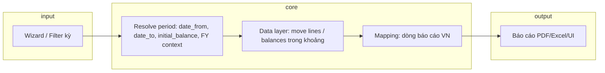

# System Architecture (khái niệm)

> Workspace hiện **chưa chứa mã Odoo**; tài liệu mô tả kiến trúc mục tiêu và các nguyên nhân lệch thường gặp trên Odoo 16 + localization VN.

## Luồng lý tưởng (sau refactor)

- **Một hợp đồng duy nhất** cho kỳ: mọi báo cáo gọi cùng lớp/hàm resolve, không tự tính `date_to` riêng theo nhánh tháng/quý.

## Nhóm nguyên nhân lệch tháng vs quý (thường gặp)

| Nhóm | Mô tả ngắn |
|------|------------|
| Date domain | Inclusive/exclusive; `date` vs `invoice_date`; timezone `datetime` |
| Số dư đầu kỳ | Một nhánh cộng opening, nhánh khác không |
| FY vs lịch | Filter quý theo fiscal year, tháng theo calendar (hoặc ngược lại) |
| Hai nguồn số | SQL vs `account.report` expression khác nhau theo kỳ |
| Logic VN | Map tài khoản / ẩn hiện dòng phụ thuộc `period` sai chỗ |

## Hướng refactor (nguyên tắc)

- **YAGNI / KISS / DRY:** không thêm nhánh kỳ mới; thu về một pipeline.
- Tách **lấy số liệu** và **trình bày**; hạn chế `if period == 'quarter'` trong mapping trừ khi luật bắt buộc.
- Có thể thay cây if bằng **bảng quyết định** / strategy theo dòng báo cáo.

## Thành phần Odoo 16 liên quan (khi có mã)

- `account.report`, `account.report.line`, expressions, wizard filter.
- Python kế thừa: `_get_lines`, helpers domain, `read_group` nếu custom.
